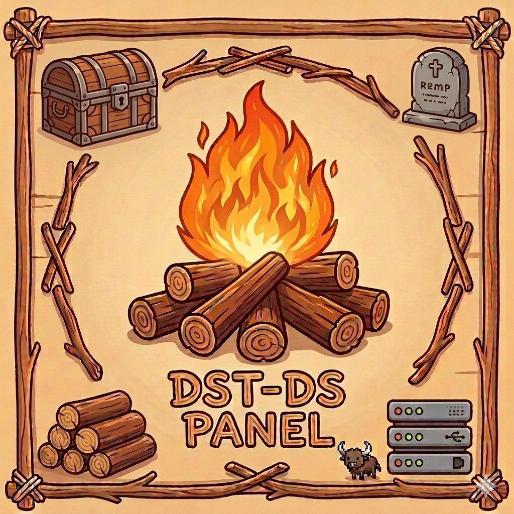

<p align="center">
  
</p>

<h1 align="center">DST DS Panel</h1>

<p align="center">
  <a href="README.md">English</a> | <a href="README_zh.md">中文</a>
</p>

<p align="center">
  A web-based management panel for Don't Starve Together dedicated servers.<br>
  Create, configure, and monitor multiple DST server clusters through a modern UI,<br>
  with each cluster running as Docker containers.
</p>

## Features

- **Cluster Management** — Create new worlds (with optional Caves), import existing saves, clone clusters
- **World Settings UI** — Visual editor for world generation with difficulty presets (Easy/Normal/Hard/Challenge) and event/festival toggles
- **Server Console** — Send Lua commands (save, rollback, announce, regenerate) directly from the UI
- **Config File Editor** — Monaco editor with Lua/INI syntax highlighting
- **Mod Management** — Add mods by Workshop ID, auto-detect mods from imported saves
- **Admin Management** — Manage server admins (adminlist.txt)
- **Player Activity** — View player join/leave, chat, and death events parsed from server logs
- **Container Lifecycle** — Start, stop, restart servers with one click
- **Live Logs** — Real-time log streaming from Master and Caves shards
- **Resource Monitoring** — Live CPU and memory charts per shard
- **Backup & Restore** — Download cluster backups as zip, import to restore
- **Auto-Backup** — Scheduled backups every N hours (configurable)
- **Discord Notifications** — Webhook alerts for server start/stop/error
- **Multi-Cluster** — Run multiple server worlds simultaneously
- **Dark Mode** — Toggle between light and dark themes
- **Authentication** — Login system with JWT tokens
- **Auto-Update** — Update DST server from the dashboard (macOS) or on each container start (Linux)
- **Single Binary** — Frontend embedded in Go binary, no separate web server needed

---

## Setup — macOS (Apple Silicon)

### Prerequisites

- [Docker Desktop](https://www.docker.com/products/docker-desktop/) or [OrbStack](https://orbstack.dev/) (recommended)
- [Homebrew](https://brew.sh/) — for installing DepotDownloader

### Step 1: Download

**Option A: macOS App (Recommended)**

Download `DST.DS.Panel.dmg` from the [Releases](../../releases) page, open the DMG, and drag the app to `/Applications`. Double-click to launch — it runs as a menu bar app with one-click server start/stop.

**Option B: Binary**

Download `dst-ds-panel-darwin-arm64` from the [Releases](../../releases) page.

```bash
chmod +x dst-ds-panel-darwin-arm64
```

### Step 2: Build the Docker Image

```bash
docker build --platform linux/amd64 -f docker/Dockerfile.dst -t dst-server:latest docker/
```

### Step 3: Install DST Server

```bash
./scripts/install-dst.sh
```

This installs DepotDownloader via Homebrew (if needed) and downloads the DST Linux dedicated server (~2GB) to `data/dst_server/`. You can also do this from the dashboard UI via the **"Update DST"** button.

### Step 4: Configure

Create `config.json` next to the binary:

```json
{
  "port": "8080",
  "dataDir": "./data",
  "imageName": "dst-server:latest",
  "platform": "linux/amd64",
  "auth": {
    "username": "admin",
    "password": "change-me",
    "secret": "change-this-to-a-random-string"
  }
}
```

### Step 5: Run

```bash
./dst-ds-panel-darwin-arm64
```

Open `http://localhost:8080` and login.

---

## Quick Start — Docker (One Command)

The fastest way to get started on any Linux server:

```bash
docker run -d \
  --name dst-ds-panel \
  -p 8080:8080 \
  -v /var/run/docker.sock:/var/run/docker.sock \
  -v dst-panel-data:/app/data \
  -e AUTH_PASSWORD=your-password \
  -e AUTH_SECRET=your-random-secret \
  -e DST_IMAGE=twskipper/dst-ds-runtime:linux \
  --restart unless-stopped \
  twskipper/dst-ds-panel:latest
```

Or use Docker Compose:

```bash
curl -O https://raw.githubusercontent.com/twskipper/dst-ds-panel/main/deploy/docker-compose.yml
curl -O https://raw.githubusercontent.com/twskipper/dst-ds-panel/main/config.example.json
cp config.example.json config.json
# Edit config.json to set your password and secret
docker compose up -d
```

Open `http://your-server:8080` and login (default: admin/change-me).

> **Note:** Docker socket mount (`/var/run/docker.sock`) is required for the panel to manage DST containers. The DST runtime image (`twskipper/dst-ds-runtime:linux`) will be pulled automatically when you start your first cluster.

---

## Setup — Linux amd64

### Prerequisites

- [Docker](https://docs.docker.com/engine/install/)

### Step 1: Download

Download `dst-ds-panel-linux-amd64` from the [Releases](../../releases) page, or build from source (see [Development](#development)).

```bash
chmod +x dst-ds-panel-linux-amd64
```

### Step 2: Build the Docker Image

```bash
docker build -f docker/Dockerfile.linux -t dst-server:latest docker/
```

This image includes SteamCMD and will automatically download/update DST server on each container start. No manual DST installation needed.

### Step 3: Configure

Create `config.json` next to the binary:

```json
{
  "port": "8080",
  "dataDir": "./data",
  "imageName": "dst-server:latest",
  "platform": "linux/amd64",
  "auth": {
    "username": "admin",
    "password": "change-me",
    "secret": "change-this-to-a-random-string"
  }
}
```

### Step 4: Run

```bash
./dst-ds-panel-linux-amd64
```

Open `http://your-server:8080` and login.

---

## Using the Panel

### 1. Get a Cluster Token

Before starting any server, you need a Klei cluster token:

1. Go to [Klei Account — Game Servers](https://accounts.klei.com/account/game/servers?game=DontStarveTogether)
2. Click **"Add New Server"**
3. Copy the generated token

Or in-game, press `~` and run `TheNet:GenerateClusterToken()`.

### 2. Create a New Cluster

1. Click **"New Cluster"** on the dashboard
2. Fill in server name, game mode, max players
3. Toggle **"Enable Caves"** on/off
4. Paste your cluster token
5. Click **"Create Cluster"**

### 3. Import an Existing Save

1. Click **"New Cluster"** → **"Import"** tab
2. Upload a zip file of your cluster directory (handles nested folders automatically)
3. Mods are automatically detected from `modoverrides.lua`

### 4. Start the Server

1. Click **"Start Server"** on the cluster detail page (requires cluster token)
2. First start may take a few minutes (downloading mods)
3. View live logs in the **Master** and **Caves** tabs

### 5. Manage the Server

- **Overview** — Edit game settings, manage admins, view player activity
- **Console** — Send commands (save, rollback, announce, regenerate), raw Lua input
- **World** — Visual world settings editor with difficulty presets (Easy/Normal/Hard/Challenge) and event toggles
- **Mods** — Add/remove mods by Workshop ID, edit per-mod configuration
- **Files** — Edit any config file with Monaco editor (Lua/INI highlighting)
- **Backup** — Download cluster as zip
- **Clone** — Duplicate cluster with a new name

### 6. Update DST Server

- **macOS**: Click **"Update DST"** on the dashboard, or run `./scripts/install-dst.sh`
- **Linux**: DST auto-updates on each container start via SteamCMD

---

## Configuration

### config.json

| Field | Default | Description |
|-------|---------|-------------|
| `port` | `"8080"` | HTTP server port |
| `dataDir` | `"./data"` | Directory for clusters, saves, and state |
| `imageName` | `"dst-server:latest"` | Docker image name for DST containers |
| `platform` | `"linux/amd64"` | Docker platform |
| `auth.username` | `"admin"` | Login username |
| `auth.password` | `"admin"` | Login password |
| `auth.secret` | — | JWT signing secret (change this!) |
| `backupInterval` | `0` | Auto-backup interval in hours (0 = disabled) |
| `discordWebhook` | `""` | Discord webhook URL for server notifications |

All fields can be overridden with environment variables: `PORT`, `DATA_DIR`, `DST_IMAGE`, `DST_PLATFORM`, `AUTH_USERNAME`, `AUTH_PASSWORD`, `AUTH_SECRET`.

---

## Development

Building from source requires [Go](https://go.dev/) 1.21+ and [Node.js](https://nodejs.org/) 18+.

```bash
# Install frontend dependencies
cd frontend && npm install && cd ..

# Development (two terminals)
make dev-backend     # Go backend on :8080
make dev-frontend    # Vite frontend on :5173 (proxies /api to :8080)

# Production build (single binary with embedded frontend)
make build           # Output: backend/dst-ds-panel

# Cross-compile for all platforms
make release         # Output: dist/dst-ds-panel-{darwin-arm64,darwin-amd64,linux-amd64}
```

## Architecture

```
Browser ──HTTP/WS──→ Go Backend ──Docker SDK──→ dst-{cluster}-master (container)
                         │                   → dst-{cluster}-caves  (container)
                         │
                    data/clusters/{name}/     (volume mounted into containers)
                    data/dst_server/          (DST binary, mounted or built-in)
```

- Each cluster's Master and Caves shards run as separate Docker containers
- Containers use **host networking** for inter-shard UDP communication
- Config files and saves are volume-mounted from `data/clusters/`
- **macOS**: DST server files are host-mounted from `data/dst_server/`
- **Linux**: DST server is installed inside the container via SteamCMD
